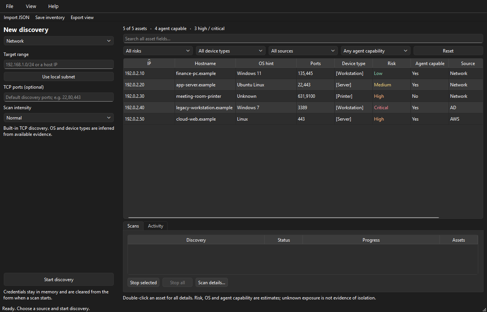

# Discovr

**Portable asset discovery for security-tool rollouts.** Build an inventory of machines that may need to be
running your security agent - on the network, in Active Directory and in AWS, Azure and GCP -
from a USB-ready app with a native desktop window. No installer, no agents, no internet
connection needed for local discovery. Cloud discovery requires access to the provider's APIs.

[](https://github.com/SowatRafi/Discovr-Assest-Discovery/actions/workflows/build.yml)



## Why Discovr

When an organisation deploys EDR or any other security agent, it rarely knows its whole
estate, so agents land on a subset of machines and the rest stay invisible. Discovr answers
one question quickly, in an unfamiliar environment, with minimal setup:
**which hosts exist, which of them can run an agent, and which need attention first?**

## Highlights

- **USB-ready, three operating systems** - self-contained app folders for Windows x64, macOS (Apple
  silicon and Intel), and Linux x64. Python and Qt are bundled; users do not install them.
- **Fast, unprivileged network sweep** - an asyncio TCP engine needs no nmap, admin rights or
  Npcap; an ARP-cache pass also finds firewalled hosts on the local segment. Gentle / normal /
  aggressive profiles protect sensitive networks.
- **Several sources, one inventory** - active network, passive observation, Active Directory, AWS,
  Azure and GCP. Cloud resources use provider identities so overlapping private addresses stay separate.
- **Answers the rollout question** - every asset gets a type (Workstation, Server, Printer,
  IoT, ...), an **Agent-capable** flag and a triage **risk** rating. Cloud VMs show whether the
  AWS SSM or Azure VM agent is reporting, i.e. whether an agent can be pushed remotely.
- **Native desktop interface** - filters, search, detail view, CSV / JSON / HTML export and JSON
  import. Works fully offline.
- **Secure by default** - the desktop has no HTTP listener or browser session; AD
  passwords are only sent over verified TLS (else NTLM); cloud credentials are supplied at runtime
  and stay in memory; reports neutralise CSV and HTML injection. See [SECURITY.md](SECURITY.md).

## Quick start

### USB app: no installer or commands

1. Download the matching **discovr-usb** archive from [Releases](https://github.com/SowatRafi/Discovr-Assest-Discovery/releases).
   Extract it once using your file manager and copy the **whole Discovr folder/app** to your USB drive.
2. Plug in the drive and double-click **Discovr.exe** on Windows, **Discovr.app** on macOS,
   or **Discovr** on Linux. Discovr opens its own desktop window.
3. Choose a discovery source and click **Start**. Export results you want to keep, then click
   **Quit** or close the window before ejecting the USB drive. The app offers to save unsaved inventory.

| System | Download |
| --- | --- |
| Windows x64 | `discovr-usb-windows-x64.zip` |
| Linux x64 | `discovr-usb-linux-x64.tar.gz` |
| macOS Apple silicon | `discovr-usb-macos-arm64.zip` |
| macOS Intel | `discovr-usb-macos-x64.zip` |

Everything Discovr needs is bundled. No Python, nmap, packet-capture driver or provider CLI
needs installing. Keep the runtime files next to the launcher. The app loads them directly
from the drive on every platform. The Mac app uses a small native launcher with its
bundled runtime inside the app, without symbolic links or per-launch extraction.
Startup and scan duration still depend on USB speed, operating-system checks and the network.

The apps are unsigned. Windows/macOS may require first-run approval through their normal
security UI. Linux file managers may require **Properties → Permissions → Allow executing file**;
the drive must allow application execution. Discovr cannot bypass a machine's security policy.
No terminal commands are needed for normal use. Check downloads against `SHA256SUMS.txt`.

Builds run on Windows, Ubuntu 22.04, macOS 14 (Apple silicon) and macOS 15 (Intel).
AD and cloud discovery need authorised credentials; enter them in the app. Passive
observation reads the OS neighbour cache and sends no packets. Raw packet capture is not included.

### Developer setup from source (Python 3.13)

```bash
git clone https://github.com/SowatRafi/Discovr-Assest-Discovery.git
cd Discovr-Assest-Discovery
python -m venv .venv
source .venv/bin/activate            # Windows: .venv\Scripts\activate
pip install --require-hashes -r requirements.lock
python -m discovr                    # native desktop
python -m discovr --help             # command line
```

## Native desktop

Double-clicking opens a Qt Widgets application with native menus, controls and file dialogs.
It does not run a browser, embedded webview or local web server.

- **New discovery** — choose Network, Neighbour cache, Active Directory, AWS, Azure or GCP.
  Start up to four scans together. The Scans tab shows progress and supports Stop selected / Stop all.
- **Scan details** — double-click a scan to read errors and coverage warnings. Incomplete means
  some regions, subscriptions or optional metadata could not be read. Cancellation preserves
  collected assets; requests already in flight may take time to finish.
- **Inventory** — search all fields and filter by risk, device type, source or agent capability.
  Sort columns and double-click an asset to inspect all provider fields.
- **Save inventory** — save every asset as a re-importable JSON report, regardless of filters.
- **Export view** — save the visible results as CSV, JSON or HTML using a normal file dialog.
- **Import JSON** — merge previous Discovr reports into the current session.
- **Close / Quit** — stop discovery and offer to save unsaved inventory before exiting.

Risk, device type, agent capability and network OS are estimates from observed evidence.
Unknown cloud exposure is never a guarantee of isolation.

## Developer CLI (optional)

The source distribution also supports headless automation. This is separate from normal USB use.
In the examples below, run `python -m discovr` in place of `discovr`.

```bash
discovr --autoipaddr                                   # sweep the local subnet
discovr --scan-network 10.10.0.0/22 --intensity gentle # sensitive network
discovr --scan-network 10.0.0.5,10.0.1.0/24 --ports 22,3389,5985-5986
discovr --ad --domain corp.local --username auditor@corp.local        # password is prompted
discovr --cloud aws                                    # every enabled region
discovr --cloud azure --subscription <id>              # omit --subscription to scan all
discovr --cloud gcp --project my-project --gcp-credentials key.json
discovr --passive --timeout 300                       # observe OS cache, no driver
discovr --scan-network 10.0.0.0/24 --save yes --format all --out ./reports
```

(From source, replace `discovr` with `python -m discovr`.)

| Option | Purpose |
|---|---|
| *(none)*, `--ui` | Native desktop |
| `--scan-network RANGE`, `--autoipaddr` | Active network sweep of a CIDR / IP / list (up to a /16), or of the local subnet |
| `--ports`, `--intensity`, `--parallel` | Port list, load profile, probes in flight |
| `--ad --domain --username [--dc] [--ldaps] [--ca-file]` | Active Directory computers (password: prompt, or `DISCOVR_AD_PASSWORD`) |
| `--cloud aws [--profile] [--region all]` | EC2 instances |
| `--cloud azure [--subscription]` | Azure virtual machines |
| `--cloud gcp [--project] [--zone] [--gcp-credentials]` | Compute Engine instances |
| `--passive [--timeout]` | Observe the OS neighbour cache without sending packets |
| `--diagnostics` | Offline validation of bundled providers and UI files; prints JSON |
| `--save yes/no`, `--format csv/json/html/both/all`, `--out DIR` | Reports (default: CSV + JSON in `Documents/discovr_reports`) |

Without `--save`, Windows asks whether to save (auto-saving after 15 seconds) and macOS/Linux
save automatically. CLI exit codes: `0` success, `1` failure, `2` invalid arguments or
incomplete cloud/directory coverage (partial reports are still saved), `130` interrupted.

## Discovery sources

### Network (active)

1. **Sweep** every address on 10 discovery ports. Any answer - an open port *or* an immediate
   refusal - proves the host is up. Plain TCP connects need no raw sockets, so no admin rights.
2. **ARP cache** - the sweep made the OS resolve every local address, so hosts whose firewall
   drops all TCP still appear, with their MAC address.
3. **Fingerprint** live hosts on 44 common service ports while reverse DNS runs in parallel; SSH
   banners and exposed services give an OS guess (Windows, domain controller, Ubuntu, iOS, ...).

| Intensity | Probes in flight | Timeout | Use for |
|---|---|---|---|
| gentle | 64 | 2 s | Fragile or monitored networks (OT, clinical, legacy) |
| normal | 512 | 1 s | Default |
| aggressive | 2,048 | 0.5 s | Large ranges when speed matters more than noise |

Worst-case sweep time is roughly *addresses × 10 ÷ probes in flight × timeout*: a silent /24
takes about 5 s at *normal*. Silent addresses dominate, and live hosts answer in milliseconds.

### Passive

The default observes the operating system's neighbour cache across local interfaces.
It sends nothing and needs no additional software or elevated rights. Records are explicitly
marked as cached evidence: entries may be stale, and this mode cannot see silent devices
that the operating system has not learned about. It observes IPv4 neighbours.

### Active Directory

Lists every computer account with OS, OU, last logon, enabled/stale state and domain-controller
role, then resolves IPs. The password is only sent inside a TLS channel whose certificate
verified (add `--ca-file corp-ca.pem` if your domain CA is not in the system trust store);
otherwise Discovr authenticates with NTLM. It is never stored. A normal domain user account is
enough.

### Cloud (credentials resolved at runtime, read-only)

| Provider | Uses | Minimum permissions |
|---|---|---|
| AWS | Dashboard access key + secret + optional session token; existing profiles, environment variables or instance role | `ec2:DescribeRegions`, `ec2:DescribeInstances`, `ec2:DescribeSecurityGroups`, `ssm:DescribeInstanceInformation` |
| Azure | Dashboard tenant/client ID + client secret; existing credentials or managed identity | built-in **Reader** role on the subscription(s) |
| GCP | Dashboard service-account key-file path; existing application credentials | **Compute Viewer** (`roles/compute.viewer`) |

Discovr lists virtual machines across all regions / subscriptions / zones and joins their
security groups, NSGs or firewall rules. **Ports** shows what the firewall allows,
**ExposedPorts** what the inspected allow rules permit from all internet addresses.
These are potential exposures, not connectivity tests: routing, NAT, load balancers,
deny rules, priorities and higher-level policies are not fully evaluated. Inspect
**ExposureAssessment** alongside the result. An empty finding does not prove isolation.

The desktop credential fields avoid installing AWS/Azure command-line tools. Leave them
blank to use an existing provider login. Prefer temporary AWS credentials and an Azure
application granted Reader access. Credential fields are cleared after starting a scan;
credentials are not written to reports. Azure currently targets the public Azure cloud.

## How assets are classified

- **Type** (`[Workstation]`, `[Server]`, `[Printer]`, `[IoT]`, `[Network]`, `[Mobile]`,
  `[Tablet]`, `[WebHost]`, `[Unknown]`) comes from the OS name, hostname, open ports and cloud
  metadata.
- **Agent-capable** is set for workstations and servers: the hosts a security agent can run on.
- **Risk** is a triage heuristic, not a vulnerability scan:

| Risk | When |
|---|---|
| Critical | Unsupported OS (XP-8.1, Server 2003-2012, CentOS 7/8), or an admin / database / file-share port open to the internet |
| High | Other internet exposure, Windows 10 (end of support Oct 2025), Telnet/FTP, IoT and printers, RDP/VNC on endpoints |
| Medium | Servers, network gear, unidentified devices |
| Low | Current, supported desktops (Windows 11, macOS) |

Local records merge by IP/MAC or an unambiguous full hostname when one record lacks an IP.
DNS suffixes are preserved. Cloud records merge by provider, account/subscription/project,
region/zone and instance ID. They are kept separate from LAN records because a private IP
alone cannot establish that they are the same machine. A precise OS name beats a port-based
guess. Repeat scans update state and exposure; they do not delete assets absent from a scan.
Keep inventories from unrelated on-premises networks separate when their addresses overlap.

## Reports

Use **Export view** to save CSV, JSON or HTML reports through a native file dialog.
Use **Save inventory** to preserve every asset as JSON, including filtered-out rows.
The optional source CLI saves to `Documents/discovr_reports/{csv,json,html}` (or `--out DIR`)
and writes a log to `.../logs`. Each field any source reported becomes a column.
JSON reports can be re-imported into the desktop.

## Building and development

```bash
pip install --require-hashes -r requirements.lock
pip install -r requirements-dev.txt
python -m pytest -q                          # unit + integration tests (no network needed)
python scripts/rebuild_macos_crypto.py       # Intel macOS: static OpenSSL; no-op elsewhere
pyinstaller --noconfirm discovr.spec         # -> dist/Discovr (all platforms)
python scripts/package_usb.py dist/discovr-usb-windows-x64.zip
python scripts/smoke_usb.py dist/discovr-usb-windows-x64.zip
# Use the matching archive name above for macOS/Linux.
docker build -t discovr .                    # CLI in a container
```

GitHub Actions (`.github/workflows/build.yml`) tests on Windows, macOS and Linux, audits
the locked dependencies with `pip-audit`, and builds four USB archives. Each archive is
extracted outside the repository to a path with spaces and tested with an empty PATH: provider diagnostics, real native widgets,
loopback scan, cancellation, filtering, export/import and window shutdown. Linux GUI acceptance
runs against Xvfb with the xcb desktop plugin; Windows and macOS use their own platform plugins. A `v*` tag prepares a **draft** release with SHA-256
checksums for maintainer review. No public release is published automatically.

See [upgrade notes](docs/UPGRADE.md) for design decisions, validation and remaining release gates.

```
discovr/
  desktop.py    double-click launcher              cli.py     optional developer CLI
  native.py     Qt Widgets desktop                 session.py discovery/session controller
  network.py    async TCP sweep engine              passive.py neighbour-cache observation
  active_directory.py  LDAP                         aws.py / azure.py / gcp.py  cloud providers
  core.py       merge, export, reporting            tagger.py / risk.py  classification
  server.py / ui/   historical web interface (excluded from USB builds and normal startup)
```

## Responsible use

Only scan networks, directories and cloud accounts you own or are explicitly authorised to
assess. Active scanning can trip intrusion-detection systems; agree the scope and timing with
the network owner first, and prefer `--intensity gentle` or passive mode on fragile networks.

## License

[MIT](LICENSE). Bundled third-party libraries retain their own licences, including Qt, PySide6 and ldap3
under LGPL-3.0. Qt remains dynamically linked and replaceable; see [Qt source and replacement notes](docs/licenses/Qt-SOURCES.txt). Every USB folder includes `THIRD_PARTY_NOTICES.txt` with exact package versions
and upstream source links.
