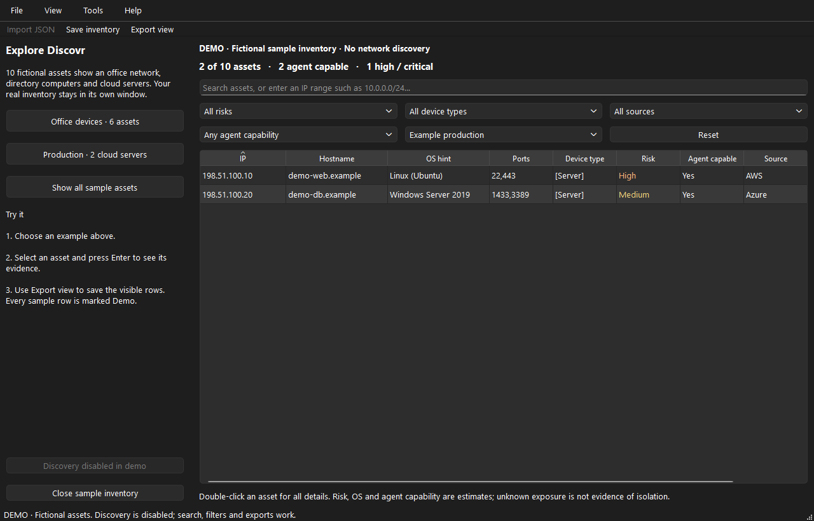

# Demo and performance evidence

## What you can try without scanning

**Help → Explore sample inventory** opens ten fictional assets in a separate native window.
The example includes Windows/Linux servers, Windows/macOS endpoints, a printer, camera,
router, AWS/Azure/GCP VMs and a cached unknown neighbour. Discovery/import/API are disabled
in the demo; search, filtering, details and exports work normally.

| Demo action | Expected result |
| --- | --- |
| Open sample inventory | 10 assets; 6 agent capable; 4 high/critical |
| Office devices / search `192.0.2.0/24` | 6 assets |
| Production environment | 2 cloud servers |
| Save inventory while filtered | All 10 assets saved |
| Export view while filtered | Only matching rows, each marked `Demo: true` |



Sample [JSON](demo/demo.json), [CSV](demo/demo.csv) and [HTML report](demo/demo.html) are
fictional output examples. None is a scan of a customer's network.

## Local measurements

Measured on Windows 11, Python 3.13.14, local SSD, using `scripts/demo_results.py`.
Raw results are in [measurements.json](demo/measurements.json).

| Measurement | Result |
| --- | --- |
| First result from a real TCP listener created on loopback | 1.91 ms |
| Complete one-host, one-port loopback scan (including DNS/cache work) | 47.34 ms |
| Correctly detected the listener's open TCP port | Yes |
| Merge, display and paint 10,000 synthetic inventory rows | 1,003.25 ms |
| Filter those 10,000 rows to one matching hostname and paint | 11.65 ms |

These are reproducible observations from one run, not a network-wide performance promise.
The benchmark includes initial ingestion; normal interactive file import parses/merges in
a worker. Search inputs debounce for 120 ms; the measured filtering time excludes that delay.
Real subnet scans depend on range size, selected ports/intensity, timeout behaviour, DNS
and host firewalls. Standard discovery does more work than Quick. Cloud/AD speed depends
on API latency, permissions, pagination and throttling. Slow USB media and antivirus can
change startup time substantially.

## Packaged acceptance

`scripts/smoke_usb.py` extracts each actual release archive outside the repository into
a path with spaces, clears PATH/PYTHONHOME/PYTHONPATH, and checks provider diagnostics,
licence notices, native launch, real loopback discovery, validation, immediate stop,
import/filter/export/full-save, demo isolation/CIDR filtering and the opt-in API. Windows
uses the native GUI subsystem, macOS LaunchServices, and Linux its xcb plugin under Xvfb.
No network other than the test's own loopback listener is actively scanned.

Optional single files are copied alone and receive the same checks, plus temporary-runtime
cleanup. CI budgets are 15 seconds for folder startup and 45 seconds for single files;
these ceilings are failure guards, not advertised expected speeds. The PR's platform logs
record startup measurements for its exact commit.

## Reproduce as a developer

```text
python scripts/demo_results.py tmp/demo-results
python scripts/smoke_usb.py dist/discovr-usb-windows-x64.zip
python scripts/smoke_usb.py dist/discovr-single-windows-x64.exe --single-file
```

Use the matching platform filenames; run the packaged Linux check through `xvfb-run -a`
on a headless CI host. None of these developer commands is needed by an end user.
