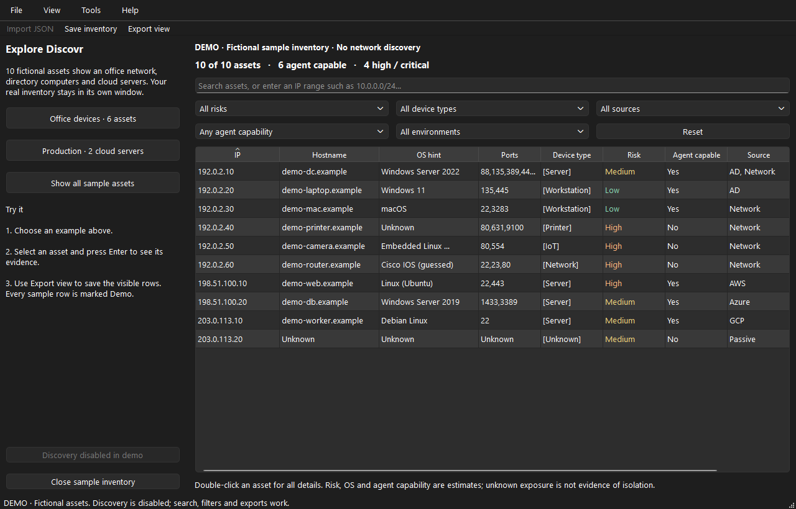

# Discovr: open, discover, save

## Start from a USB drive

Extract the download for your operating system once, then copy the **whole Discovr folder**
to your drive. On Windows double-click **Discovr.exe**; on macOS **Discovr.app**;
on Linux **Discovr**. No installer, terminal, Python, nmap, capture driver or cloud CLI is needed.
Discovr has no command-line mode; use the native menus and controls for every operation.
The app opens a native desktop window. An internet connection is unnecessary for local discovery.

The fast folder is recommended. Optional Windows/Linux single-file builds are easier to copy
but unpack on every launch. Windows/macOS may show an unsigned-app approval; Linux may need
the file manager's **Properties → Permissions → Allow executing file**. A managed machine
may prohibit USB execution. Discovr cannot override that policy.

## Try the offline demo first

Choose **Help → Explore sample inventory**. This opens a separate window with ten fictional
assets. No real scan runs, and your real inventory remains separate.

1. Click **Office devices · 6 assets** to see servers, laptops, a printer, camera and router.
2. Click **Production · 2 cloud servers** to try environment grouping.
3. Select an asset and press **Enter**, or double-click it, to inspect all evidence.
4. Click **CSV**, **HTML** or **JSON** above the table. Only visible rows are exported.
5. Click **Show all sample assets**, then **Save inventory** to save every sample as JSON.
6. Close the sample window to return to real work. Every sample export carries `Demo: true`.

Expected sample results: **10 assets**, **6 agent capable**, **4 high/critical**; office filter
**6**, production filter **2**. These are illustrative classifications, not findings from your network.

## Discover your network

1. Select **Network**, then **Use local subnet**. Review the range before starting. You can
   enter one IPv4 address, a CIDR such as `10.20.0.0/24`, or a comma-separated list.
2. Keep **Standard** for richer device details, or choose **Quick** for ten common ports
   without extended port probes or service identification. Both resolve names when available.
3. Optionally enter an **Environment label**, such as a client name or “Production”.
4. For sensitive networks, open **More scan options** and select **Gentle**. Optional custom
   TCP ports replace the built-in list; blank means use the selected profile.
5. Select **Start discovery**. Hosts appear as they respond; details improve as work continues.
6. The Scans panel shows progress, elapsed time, asset count and warnings. **Stop selected**
   keeps results already found. Up to four discoveries can run together.

The default-route subnet may be a VPN or only one of several interfaces. Review it; Discovr
does not know every remote VLAN. Unknown OS/hostname fields are legitimate results.
`SeenVia` distinguishes a TCP response from possibly stale neighbour-cache evidence.

### Get more detail for a device

Select a row and click **Identify selected**. This starts a Standard discovery for that one
IPv4 address and updates its existing row. It is especially useful for older imports and
neighbour-cache entries, which contain no port scan. Cloud rows use their provider source
instead, because their private IPs can belong to a different network.

Standard discovery checks 44 common TCP ports, SSH banners, up to three web-service
descriptions, and one targeted UPnP discovery query per remote device. It never follows
web redirects, logs in, changes UPnP settings or sends multicast searches. This computer's
OS is read directly; its additional local TCP listeners are checked when the OS permits
reading them. Default gateways are recognised from the OS routing table.

Hover over **OS hint**, **Ports** or **Device type** for evidence; double-click for full
details, including `PortsChecked`, `PortStatus`, `OSConfidence`, `OSEvidence` and `SSDPServer`.
Remote OS names remain labelled **guessed**. A product's advertised description can be wrong.

- **Not checked**: this record has no port-check evidence. Choose Identify selected.
- **Checking… / Incomplete check**: work is still running or was stopped early.
- **No open ports found**: the device answered, but none of the checked ports accepted a connection.
- **No TCP response**: the checked ports did not answer; the device may be filtered or offline.
- **Not identified**: no usable OS/device evidence was returned. Closed services and firewalls
  can prevent identification. AD can supply an OS for managed computers.

The default list does not cover every TCP port or all UDP services. Use **More scan options →
TCP ports** for a known service outside it. Explicit custom ports skip the UPnP query.

## Other sources

| Source | What to provide | What to expect |
| --- | --- | --- |
| Neighbour cache | Observation duration, 10–3,600 seconds | Devices already in this computer's OS cache. No packets sent; entries may be stale. |
| Active Directory | DNS domain, username and password; optional controller/LDAPS/CA | Computer accounts, OS, OU, last logon, enabled/stale and domain-controller context. |
| AWS | Access key and secret; optional session token; region or `all` | EC2 instances with region, identity, agent and firewall context. Existing profiles are optional. |
| Azure | Tenant ID, application/client ID and client secret; optional subscription | VM inventory across accessible subscriptions; grant the application Reader access. |
| GCP | Service-account JSON key; optional project and zone | Compute Engine VMs; project can come from the key; Compute Viewer access is sufficient for inventory. |

Credentials stay in memory during discovery and are cleared from form fields after successful
submission. Cloud/AD need authorised credentials and network access. No provider tools are downloaded.
**Incomplete** means some requested data could not be read; inspect warnings before treating
an inventory as complete. Cloud exposure is an allow-rule estimate, not an external connectivity test.

## Find and save assets

- **Search** searches all fields. A valid CIDR such as `192.0.2.0/24` selects that IP range.
- **Filters** combine risk, device type, source, agent capability and environment. **Reset filters** shows all rows again.
- **Clear results…** confirms, stops running scans and removes all rows, including hidden ones.
  Late scan responses cannot put cleared rows back. Saved files and scan history are kept.
- **Enter/double-click** opens full details, including metadata not shown in the table.
- **CSV / HTML / JSON** buttons write the visible rows in that format. **Export view** also offers all three formats.
- **Save inventory** writes every asset as JSON, even when filters hide some rows.
- **Import report** reads CSV, JSON or Discovr HTML; imports are limited to 32 MB and 65,536 records.

To **convert a report**, start with an empty inventory, click **Import report**, choose the file,
then click the output format button. JSON and new Discovr HTML preserve structured metadata;
CSV is a flat spreadsheet with explicit boolean conversion. HTML import requires a report
exported by this version with its embedded conversion data; arbitrary websites and older HTML
reports are not importable. No browser opens during conversion and no online converter is used.

Keep unrelated LANs with overlapping IPs in separate inventories; an environment label does
not change identity matching. Cloud identity is scoped by provider/account/project/region/resource.
Reports can contain sensitive client information. Save to the intended USB/client folder.
An asterisk in the window title means unsaved inventory. Failed writes preserve an existing report.

## Finish

Close Discovr or choose **File → Quit**. Confirm stopping work if needed, then save inventory
you want to keep. Cancel returns to the app. Wait for it to close before ejecting the drive.
No background service remains. For external integrations, see [the optional local API](API.md).

Keyboard: **Ctrl/Cmd+O** import, **Ctrl/Cmd+S** complete save, **Ctrl+E** export view,
**Ctrl/Cmd+F** search, **Enter** asset details, **Tab/Shift+Tab** move between controls.
